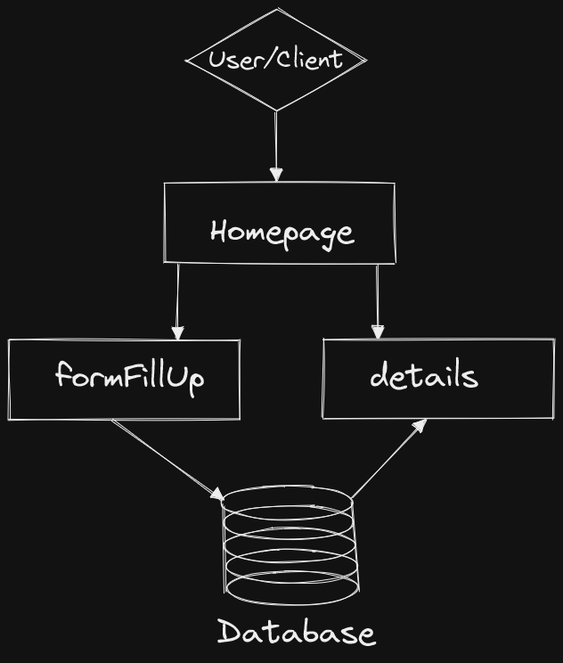

# Microservice Demo

This is a demo or POC to understand better how microservices work in real world.

# Disclaimer
1. WORK IN PROGRESS
2. So far it is monolith application. We need to divde it into microservices.
3. Microservice code is coming soon.

# Microservice Architechture

## Go Installation

Follow the instructions [here](https://golang.org/doc/install)

## How to execute the application on your machine (Monolith)

1. Clone the repo `git clone https://github.com/sharifulakhter/microservice-demo.git`
2. Change you working directory `cd microservice-demo/application`
3. Build the application i.e. compile the code `go build`
4. Execute the binary `./application`
5. Open this [link](http://localhost/)
6. Version 2.0.0
